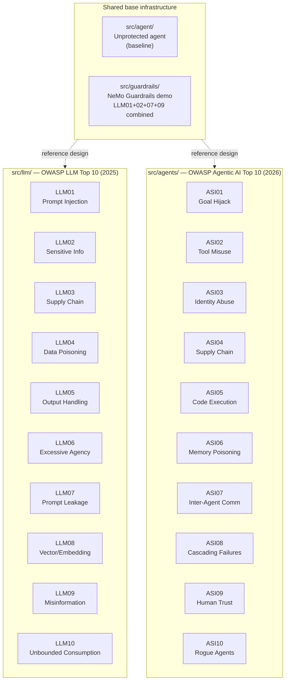

# AI Security PoC

A hands-on reference implementation covering the **OWASP Top 10 for LLM Applications 2025** and the **OWASP Top 10 for Agentic Applications 2026**.

Each of the 20 risks has its own self-contained module with:
- A **vulnerable application** that demonstrates the attack in practice
- Working **exploit tools and payloads** for dynamic analysis
- A **mitigated application** with the security controls active
- A **test harness** (`exploits/run_tests.py`) that can be run in CI
- A **README** with architecture diagrams, sequence diagrams, and step-by-step explanations

---

## Reference frameworks

| Framework | Version | Risks | Official reference |
|---|---|---|---|
| OWASP Top 10 for LLM Applications | 2025 | LLM01–LLM10 | [genai.owasp.org/llm-top-10](https://genai.owasp.org/llm-top-10/) |
| OWASP Top 10 for Agentic Applications | 2026 | ASI01–ASI10 | [genai.owasp.org/resource/owasp-top-10-for-agentic-applications-for-2026](https://genai.owasp.org/resource/owasp-top-10-for-agentic-applications-for-2026/) |

---

## Overall architecture

The project is organised into three layers. The shared base provides the unprotected agent and the full NeMo Guardrails integration. Each risk module is independent and self-contained — it imports nothing from other risk modules except where explicitly noted.



---

## How each module works

Every risk module follows the same structure, making it easy to study and extend:

```
llmXX_<risk_name>/          or    asiXX_<risk_name>/
├── README.md               ← architecture diagram + sequence diagram + docs
├── vulnerable/
│   └── agent.py (or app.py)  ← demonstrates the vulnerability — run this first
├── mitigated/
│   ├── agent.py (or app.py)  ← same scenario with defences active
│   ├── <control>.py          ← the mitigation implementation (validator, filter, etc.)
│   └── config/               ← NeMo Guardrails configs where applicable
└── exploits/
    ├── payloads.py           ← attack payload library
    └── run_tests.py          ← dynamic analysis harness — run against both apps
```

The test harness always follows the same contract:
- Exits `0` if all mitigated-agent tests pass
- Exits `1` if any attack succeeded against the mitigated agent
- Skips tests that require an API key when `OPENAI_API_KEY` is not set

---

## OWASP LLM Top 10 (2025) coverage

| ID | Risk | Mitigation techniques | Module | Status |
|---|---|---|---|---|
| LLM01 | Prompt Injection | NeMo Guardrails rails · tool result regex scan · data-plane wrapping · garak | [llm01_prompt_injection](src/llm/llm01_prompt_injection/README.md) | ✅ done |
| LLM02 | Sensitive Information Disclosure | Microsoft Presidio NLP · regex filter · NeMo Guardrails output rails | [llm02_sensitive_information](src/llm/llm02_sensitive_information/README.md) | ✅ done |
| LLM03 | Supply Chain Vulnerabilities | pip-audit · Syft · Grype · SHA-256 model integrity · `weights_only=True` | [llm03_supply_chain](src/llm/llm03_supply_chain/README.md) | ✅ done |
| LLM04 | Data & Model Poisoning | Dataset checksum verification · backdoor pattern scan · RAG cluster anomaly detection | [llm04_data_model_poisoning](src/llm/llm04_data_model_poisoning/README.md) | ✅ done |
| LLM05 | Improper Output Handling | bleach HTML sanitisation · Pydantic schema validation · `shell=False` + allowlist | [llm05_improper_output_handling](src/llm/llm05_improper_output_handling/README.md) | ✅ done |
| LLM06 | Excessive Agency | Least-privilege tool registry · HITL approval gate · scope enforcement | [llm06_excessive_agency](src/llm/llm06_excessive_agency/README.md) | ✅ done |
| LLM07 | System Prompt Leakage | Prompt hardening · NeMo output rails · canary token detection | [llm07_system_prompt_leakage](src/llm/llm07_system_prompt_leakage/README.md) | ✅ done |
| LLM08 | Vector & Embedding Weaknesses | RAGuard authority-framing scan · embedding cluster detection · per-tenant namespaces | [llm08_vector_embedding_weaknesses](src/llm/llm08_vector_embedding_weaknesses/README.md) | ✅ done |
| LLM09 | Misinformation | NeMo hallucination rail · epistemic hedging system prompt · secondary LLM call | [llm09_misinformation](src/llm/llm09_misinformation/README.md) | ✅ done |
| LLM10 | Unbounded Consumption | slowapi rate limiting · tiktoken input budget · `max_tokens` cap · cost circuit breaker | [llm10_unbounded_consumption](src/llm/llm10_unbounded_consumption/README.md) | ✅ done |

---

## OWASP Agentic AI Top 10 (2026) coverage

| ID | Risk | Mitigation techniques | Module | Status |
|---|---|---|---|---|
| ASI01 | Agent Goal Hijack | Goal integrity monitor · tool result regex scan · data-plane wrapping · tool allowlist · canary tokens | [asi01_agent_goal_hijack](src/agents/asi01_agent_goal_hijack/README.md) | ✅ done |
| ASI02 | Tool Misuse & Exploitation | Pydantic argument validators · path traversal guard · SSRF guard · email domain allowlist | [asi02_tool_misuse](src/agents/asi02_tool_misuse/README.md) | ✅ done |
| ASI03 | Identity & Privilege Abuse | PyJWT short-lived scoped tokens · HMAC-SHA256 inter-agent message signing · nonce replay protection | [asi03_identity_privilege_abuse](src/agents/asi03_identity_privilege_abuse/README.md) | ✅ done |
| ASI04 | Agentic Supply Chain Vulnerabilities | MCP server allowlist · risk scanner · pip-audit · RestrictedPython pickle guard | [asi04_supply_chain](src/agents/asi04_supply_chain/README.md) | ✅ done |
| ASI05 | Unexpected Code Execution (RCE) | AST static validator · RestrictedPython `safe_eval` · `safe_subprocess` (`shell=False` + allowlist) | [asi05_unexpected_code_execution](src/agents/asi05_unexpected_code_execution/README.md) | ✅ done |
| ASI06 | Memory & Context Poisoning | HMAC tamper-evident memory · write-time poisoning scan · read-time signature verification · cross-user isolation | [asi06_memory_context_poisoning](src/agents/asi06_memory_context_poisoning/README.md) | ✅ done |
| ASI07 | Insecure Inter-Agent Communication | HMAC-SHA256 message signing · nonce store · timestamp freshness check · agent identity registry | [asi07_insecure_interagent_communication](src/agents/asi07_insecure_interagent_communication/README.md) | ✅ done |
| ASI08 | Cascading Failures | `CircuitBreaker` (CLOSED/OPEN/HALF_OPEN) · Pydantic step validator · `TimeoutBudget` context manager | [asi08_cascading_failures](src/agents/asi08_cascading_failures/README.md) | ✅ done |
| ASI09 | Human-Agent Trust Exploitation | Authority claim detector · urgency pattern detector · structured HITL gate · `MIN_REVIEW_SECONDS` | [asi09_human_agent_trust](src/agents/asi09_human_agent_trust/README.md) | ✅ done |
| ASI10 | Rogue Agents | `KillSwitch` · `BehaviorMonitor` (tool/file/external limits) · `ImmutableGoal` (SHA-256) · `DelegationContext` depth limit | [asi10_rogue_agents](src/agents/asi10_rogue_agents/README.md) | ✅ done |

---

## Shared base infrastructure

`src/agent/` and `src/guardrails/` predate the per-risk module structure and remain as standalone demos:

| Component | Path | Role |
|---|---|---|
| Base agent | `src/agent/` | Unprotected conversational agent with tool-calling loop — the baseline before any mitigation |
| NeMo Guardrails demo | `src/guardrails/` | Full NeMo integration with **LLM01 + LLM02 + LLM07 + LLM09 rails active simultaneously**, audit logging to JSON Lines |

See [`src/guardrails/README.md`](src/guardrails/README.md) for the full technical documentation: pipeline architecture, Colang flows, Python actions, audit logger, and extension guide.

---

## Requirements

- Python 3.11+
- An [OpenAI API key](https://platform.openai.com/api-keys)

Per-module optional dependencies (Presidio, NeMo Guardrails, slowapi, PyJWT, etc.) are listed in each module's `README.md` under the **Tools** section.

---

## Setup

```bash
# 1. Create and activate a virtual environment
python -m venv .venv
source .venv/bin/activate      # Windows: .venv\Scripts\activate

# 2. Install base dependencies
pip install -r requirements.txt

# 3. Configure environment variables
cp .env.example .env
# Edit .env and set your OPENAI_API_KEY
```

---

## Running the modules

### Shared base agents

| Command | Description |
|---|---|
| `python -m src.agent.main` | Baseline agent — no security controls |
| `python -m src.guardrails.main` | NeMo Guardrails demo — LLM01 · LLM02 · LLM07 · LLM09 rails active |

### Per-risk module pattern

Each module exposes the same three entry points:

```bash
# 1. Run the vulnerable application (demonstrates the attack)
python -m src.llm.llmXX_<name>.vulnerable.agent   # or .app

# 2. Run the mitigated application (defences active)
python -m src.llm.llmXX_<name>.mitigated.agent    # or .app

# 3. Run the dynamic analysis test harness
python -m src.llm.llmXX_<name>.exploits.run_tests

# Same pattern for agentic modules
python -m src.agents.asiXX_<name>.exploits.run_tests
```

### Quick test examples

```bash
# No API key required — pure logic tests
python -m src.agents.asi10_rogue_agents.exploits.run_tests
python -m src.agents.asi08_cascading_failures.exploits.run_tests
python -m src.agents.asi05_unexpected_code_execution.exploits.run_tests
python -m src.agents.asi06_memory_context_poisoning.exploits.run_tests
python -m src.llm.llm03_supply_chain.exploits.run_tests
python -m src.llm.llm04_data_model_poisoning.exploits.run_tests

# Requires OPENAI_API_KEY
python -m src.llm.llm01_prompt_injection.exploits.run_tests
python -m src.llm.llm02_sensitive_information.exploits.run_tests

# Test only the mitigated agent, with verbose output
TARGET=mitigated VERBOSE=1 python -m src.llm.llm07_system_prompt_leakage.exploits.run_tests
```

---

## Project structure

```
ai-security-poc/
├── README.md
├── requirements.txt
├── .env.example
├── .gitignore
│
└── src/
    ├── agent/                          # Shared base: unprotected agent
    │   ├── agent.py
    │   ├── tools.py
    │   └── main.py
    │
    ├── guardrails/                     # Shared base: NeMo Guardrails demo
    │   ├── README.md
    │   ├── guardrails_agent.py
    │   ├── actions.py
    │   ├── audit.py
    │   ├── main.py
    │   └── config/
    │       ├── config.yml
    │       └── rails.co
    │
    ├── llm/                            # OWASP LLM Top 10 (2025)
    │   ├── llm01_prompt_injection/
    │   │   ├── README.md               ← architecture + sequence diagrams
    │   │   ├── vulnerable/             ← demonstrates the attack
    │   │   ├── mitigated/              ← defences active
    │   │   └── exploits/               ← payloads + run_tests.py
    │   ├── llm02_sensitive_information/
    │   ├── llm03_supply_chain/
    │   ├── llm04_data_model_poisoning/
    │   ├── llm05_improper_output_handling/
    │   ├── llm06_excessive_agency/
    │   ├── llm07_system_prompt_leakage/
    │   ├── llm08_vector_embedding_weaknesses/
    │   ├── llm09_misinformation/
    │   └── llm10_unbounded_consumption/
    │
    └── agents/                         # OWASP Agentic AI Top 10 (2026)
        ├── asi01_agent_goal_hijack/
        │   ├── README.md               ← architecture + sequence diagrams
        │   ├── vulnerable/
        │   ├── mitigated/
        │   └── exploits/
        ├── asi02_tool_misuse/
        ├── asi03_identity_privilege_abuse/
        ├── asi04_supply_chain/
        ├── asi05_unexpected_code_execution/
        ├── asi06_memory_context_poisoning/
        ├── asi07_insecure_interagent_communication/
        ├── asi08_cascading_failures/
        ├── asi09_human_agent_trust/
        └── asi10_rogue_agents/
```
