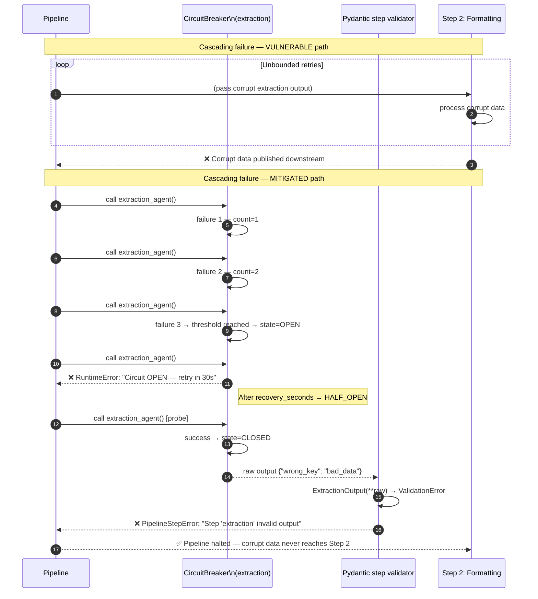

# ASI08 — Cascading Failures

> **OWASP Agentic AI Top 10 2026** · [Official reference](https://genai.owasp.org/resource/owasp-top-10-for-agentic-applications-for-2026/) · **Status**: 🔜 planned

---

## Architecture and sequence diagrams

### Architecture diagram — attack vs mitigation

The vulnerable pipeline passes errors and corrupt outputs silently between pipeline steps — a single failure early in the chain causes all downstream steps to operate on invalid data or enter infinite retry loops. The mitigated pipeline adds a circuit breaker on each step, a Pydantic schema validator between steps, and a hierarchical timeout budget.

```mermaid
graph TD
    subgraph VULNERABLE["❌ Vulnerable pipeline — no isolation"]
        V_S1[Step 1: Extraction agent] -->|corrupt output — no validation| V_S2[Step 2: Formatting agent]
        V_S2 -->|corrupt data — no circuit breaker| V_S3[Step 3: Publishing agent]
        V_S3 --> V_OUT([❌ Corrupt data published])
        V_RETRY["Unbounded retry loop\n(infinite cost / DoS)"] -.-> V_S1
    end

    subgraph MITIGATED["✅ Resilient pipeline — circuit breakers + step validation"]
        M_S1[Step 1: Extraction] --> M_CB1{CircuitBreaker\nextraction}
        M_CB1 -->|3+ failures → OPEN| M_BLOCK([Step blocked\nHTTP 503])
        M_CB1 -->|call passes| M_VAL1[Pydantic validator\nExtractionOutput schema]
        M_VAL1 -->|invalid → PipelineStepError| M_BLOCK2([Pipeline halted])
        M_VAL1 -->|valid| M_S2[Step 2: Formatting]
        M_S2 --> M_CB2{CircuitBreaker\nformatting}
        M_CB2 --> M_VAL2[Pydantic validator\nFormattingOutput schema]
        M_VAL2 --> M_S3[Step 3: Publishing]
        M_TBudget[TimeoutBudget\n120s total] -.->|per-step allocation| M_S1
        M_TBudget -.-> M_S2
        M_TBudget -.-> M_S3
    end

    style VULNERABLE fill:#fff0f0,stroke:#ff4444
    style MITIGATED  fill:#f0fff0,stroke:#44aa44
```



---

### Sequence diagram — cascading failure and circuit breaker mitigation

**Steps:**
1. Step 1 (extraction agent) fails repeatedly due to a downstream dependency issue.
2. **Vulnerable path**: the pipeline retries indefinitely, consuming resources and eventually publishing corrupt data.
3. **Mitigated path**:
   - Step 3: After `failure_threshold=3` consecutive failures, the `CircuitBreaker` transitions to `OPEN` state.
   - Step 4: All subsequent calls are blocked immediately (no retry, no resource consumption) with a `RuntimeError`.
   - Step 5: After `recovery_seconds`, the breaker transitions to `HALF_OPEN` and allows one probe call.
   - Step 6: Even if a call passes the circuit breaker, `validate_step()` checks the output schema — a corrupt output raises `PipelineStepError` and halts the pipeline before the data propagates downstream.



---

## What is this risk?

In multi-agent systems, a failure or compromise in one agent can propagate to dependent agents, causing a chain of failures that amplifies the original fault into system-wide harm. Agentic workflows are particularly vulnerable because:

- Agents act autonomously without human checkpoints
- Tool calls chain together across agents
- A single bad decision early in a pipeline determines all downstream actions
- Errors in agentic loops can be self-reinforcing

| Failure mode | Description | Example |
|---|---|---|
| **Error propagation** | Agent A fails silently; Agent B proceeds based on corrupt output | Data extraction agent returns wrong schema → formatting agent produces corrupt files → upload agent publishes corrupt data |
| **Amplification loops** | An agent's output triggers a cascade of the same action | Retry loop without circuit breaker sends 10,000 API calls |
| **Blast radius expansion** | A localized failure escalates due to excessive permissions | One compromised agent has credentials for all downstream systems |
| **Trust chain collapse** | Agent B trusts Agent A's output as authoritative → A's failure becomes B's security compromise | Compromised classification agent causes all subsequent agents to mishandle data |

---

## Attack technique

### Amplification via retry loop

```python
# VULNERABLE: unbounded retry loop — one failure causes 10,000 API calls
def process_with_retry(task: str, max_retries: int = 10000):
    for attempt in range(max_retries):
        result = agent.run(task)
        if result.get("status") != "success":
            continue  # retry forever — no backoff, no circuit breaker
        return result
```

### Error propagation through pipeline

```python
# VULNERABLE: pipeline passes corrupt data without validation
def pipeline(input_data):
    extracted = extraction_agent.run(input_data)      # may return None on error
    formatted = formatting_agent.run(extracted)        # crashes or produces corrupt output
    published = publishing_agent.run(formatted)        # publishes corrupt data
    # No validation between steps — one silent failure corrupts the whole pipeline
```

---

## Module structure

```
asi08_cascading_failures/
├── README.md
├── vulnerable/
│   └── pipeline.py           # Multi-agent pipeline with no error isolation
├── mitigated/
│   ├── pipeline.py           # Pipeline with circuit breakers and blast radius limits
│   ├── circuit_breaker.py    # Circuit breaker pattern for agent calls
│   ├── step_validator.py     # Output validation between pipeline steps
│   └── timeout_budget.py     # Hierarchical timeout budget for agent chains
└── exploits/
    └── amplification_loop.py  # Triggers an unbounded retry amplification
```

---

## Tools

| Tool | Role | Install |
|---|---|---|
| [tenacity](https://github.com/jd/tenacity) | Retry with exponential backoff + circuit breaker + jitter | `pip install tenacity` |
| [Pydantic](https://docs.pydantic.dev/) | Schema validation between pipeline steps — rejects corrupt intermediate outputs | `pip install pydantic` |

---

## Mitigation

### Circuit breaker for agent calls

```python
# mitigated/circuit_breaker.py

import time
from enum import Enum
from dataclasses import dataclass, field

class State(Enum):
    CLOSED = "closed"       # normal — calls pass through
    OPEN = "open"           # tripped — calls blocked immediately
    HALF_OPEN = "half_open" # probe — one test call allowed

@dataclass
class AgentCircuitBreaker:
    """
    Circuit breaker that trips when an agent fails too many times,
    preventing cascading failures from propagating to downstream agents.
    """
    failure_threshold: int = 3       # open after N consecutive failures
    recovery_timeout: float = 30.0   # try again after N seconds
    name: str = "agent"

    _state: State = field(default=State.CLOSED, init=False)
    _failure_count: int = field(default=0, init=False)
    _last_failure_time: float = field(default=0.0, init=False)

    def call(self, func, *args, **kwargs):
        """Execute func through the circuit breaker."""
        if self._state == State.OPEN:
            if time.time() - self._last_failure_time > self.recovery_timeout:
                self._state = State.HALF_OPEN
                print(f"[CircuitBreaker:{self.name}] Attempting recovery (HALF_OPEN)")
            else:
                raise RuntimeError(
                    f"[CircuitBreaker:{self.name}] Circuit is OPEN — "
                    f"call blocked to prevent cascading failures. "
                    f"Retry in {self.recovery_timeout - (time.time() - self._last_failure_time):.0f}s"
                )

        try:
            result = func(*args, **kwargs)
            self._on_success()
            return result
        except Exception as e:
            self._on_failure()
            raise

    def _on_success(self):
        self._failure_count = 0
        self._state = State.CLOSED

    def _on_failure(self):
        self._failure_count += 1
        self._last_failure_time = time.time()
        if self._failure_count >= self.failure_threshold:
            self._state = State.OPEN
            print(
                f"[CircuitBreaker:{self.name}] TRIPPED after {self._failure_count} failures. "
                f"Blocking calls for {self.recovery_timeout}s."
            )
```

### Step validation between pipeline stages

```python
# mitigated/step_validator.py

from pydantic import BaseModel, ValidationError
from typing import TypeVar, Type

T = TypeVar("T", bound=BaseModel)

def validate_step_output(
    raw_output: dict,
    schema: Type[T],
    step_name: str,
) -> T:
    """
    Validate the output of a pipeline step against a Pydantic schema
    before passing it to the next step.

    Raises PipelineStepError if the output is invalid,
    preventing corrupt data from propagating downstream.
    """
    try:
        return schema(**raw_output)
    except ValidationError as e:
        raise PipelineStepError(
            f"Step '{step_name}' produced invalid output — pipeline halted. "
            f"Validation errors: {e}"
        )

class PipelineStepError(Exception):
    """Raised when a pipeline step produces output that fails schema validation."""

# Example schemas for a data processing pipeline
class ExtractionOutput(BaseModel):
    records: list[dict]
    record_count: int
    source: str

class FormattingOutput(BaseModel):
    formatted_data: str
    format_type: str     # "json" | "csv" | "xml"
    checksum: str
```

### Hierarchical timeout budget

```python
# mitigated/timeout_budget.py

import time
from contextlib import contextmanager

class TimeoutBudget:
    """
    Hierarchical timeout budget that allocates time slices to pipeline steps.
    When the overall budget is exhausted, all remaining steps are cancelled.
    """

    def __init__(self, total_seconds: float):
        self.total_seconds = total_seconds
        self._start = time.time()

    @property
    def remaining(self) -> float:
        return max(0.0, self.total_seconds - (time.time() - self._start))

    @property
    def is_exhausted(self) -> bool:
        return self.remaining <= 0.0

    @contextmanager
    def step(self, step_name: str, allocated_seconds: float):
        """Context manager that enforces a per-step timeout within the overall budget."""
        if self.is_exhausted:
            raise TimeoutError(
                f"Pipeline timeout budget exhausted before step '{step_name}'. "
                f"Aborting to prevent runaway execution."
            )
        step_budget = min(allocated_seconds, self.remaining)
        step_start = time.time()
        yield step_budget
        elapsed = time.time() - step_start
        if elapsed > step_budget:
            raise TimeoutError(
                f"Step '{step_name}' exceeded its timeout budget "
                f"({elapsed:.1f}s > {step_budget:.1f}s)."
            )
```

### Resilient pipeline

```python
# mitigated/pipeline.py

from .circuit_breaker import AgentCircuitBreaker
from .step_validator import validate_step_output, ExtractionOutput, FormattingOutput
from .timeout_budget import TimeoutBudget

extraction_cb = AgentCircuitBreaker(name="extraction_agent", failure_threshold=3)
formatting_cb = AgentCircuitBreaker(name="formatting_agent", failure_threshold=3)
publishing_cb = AgentCircuitBreaker(name="publishing_agent", failure_threshold=2)

def safe_pipeline(input_data: dict) -> dict:
    """
    Multi-agent pipeline with circuit breakers, step validation, and timeout budget.
    MITIGATED: failures are isolated; corrupt outputs are rejected before propagation.
    """
    budget = TimeoutBudget(total_seconds=120)

    # Step 1: extraction
    with budget.step("extraction", allocated_seconds=40):
        raw_extraction = extraction_cb.call(extraction_agent.run, input_data)
        extraction = validate_step_output(raw_extraction, ExtractionOutput, "extraction")

    # Step 2: formatting — only runs if extraction succeeded and was validated
    with budget.step("formatting", allocated_seconds=30):
        raw_formatting = formatting_cb.call(formatting_agent.run, extraction.dict())
        formatting = validate_step_output(raw_formatting, FormattingOutput, "formatting")

    # Step 3: publishing — only runs if all prior steps succeeded
    with budget.step("publishing", allocated_seconds=20):
        result = publishing_cb.call(publishing_agent.run, formatting.dict())

    return result
```

---

## Verification

```bash
# Test circuit breaker trips after 3 failures
python -c "
from mitigated.circuit_breaker import AgentCircuitBreaker

cb = AgentCircuitBreaker(name='test', failure_threshold=3)

def failing_agent():
    raise RuntimeError('Agent failed')

for i in range(5):
    try:
        cb.call(failing_agent)
    except RuntimeError as e:
        print(f'Attempt {i+1}: {type(e).__name__}: {e}')
# Expected: first 3 = RuntimeError (agent failed), 4th+ = RuntimeError (circuit OPEN)
"

# Test step validation rejects corrupt output
python -c "
from mitigated.step_validator import validate_step_output, ExtractionOutput, PipelineStepError
try:
    validate_step_output({'wrong_field': 'bad_data'}, ExtractionOutput, 'extraction')
except PipelineStepError as e:
    print(f'Corrupt output rejected: {e}')
"
```

---

## References

- [OWASP ASI08 — Cascading Failures](https://genai.owasp.org/resource/owasp-top-10-for-agentic-applications-for-2026/)
- [Circuit Breaker pattern — Martin Fowler](https://martinfowler.com/bliki/CircuitBreaker.html)
- [tenacity — Python retry library](https://tenacity.readthedocs.io/)
- [Pydantic — data validation](https://docs.pydantic.dev/)
