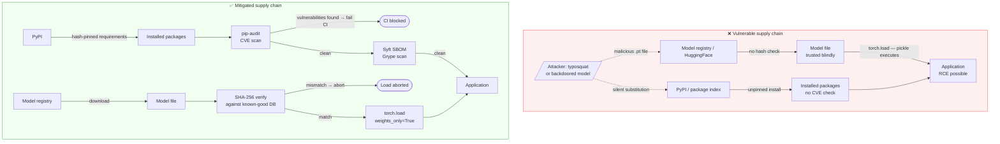
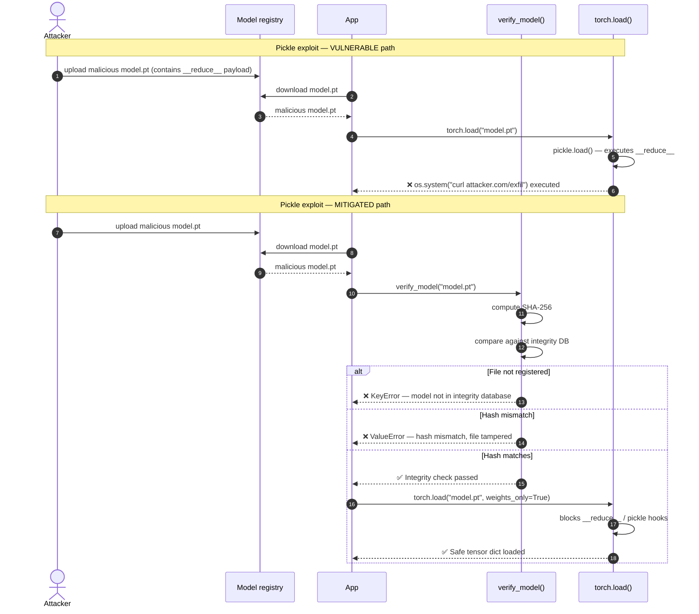

# LLM03 — Supply Chain Vulnerabilities

> **OWASP LLM Top 10 2025** · [Official reference](https://genai.owasp.org/llmrisk/llm032025-supply-chain/) · **Status**: 🔜 planned

---

## Architecture and sequence diagrams

### Architecture diagram — attack vs mitigation

Supply chain attacks happen before the application runs. The vulnerable pipeline has no integrity checks at any stage. The mitigated pipeline adds three checkpoints: dependency CVE scanning (pip-audit), SBOM generation (Syft/Grype), and model file integrity verification (SHA-256 + `weights_only=True`) before any model is loaded.



---

### Sequence diagram — pickle exploit attack and mitigation

**Steps:**
1. An attacker publishes a malicious model file whose `.pt` serialisation contains a `__reduce__` method that executes an OS command.
2. **Vulnerable path**: `torch.load()` without `weights_only=True` deserialises the file using Python's `pickle`, triggering arbitrary code execution.
3. **Mitigated path**:
   - Step 3: Before loading, `verify_model()` computes the SHA-256 hash of the file and compares it against the integrity database. An unregistered or tampered file raises an exception and loading never happens.
   - Step 4: Even if the hash check passed, `torch.load(weights_only=True)` blocks the `__reduce__` pickle hook, preventing code execution.



---

## What is this risk?

The AI supply chain spans every component involved in building and deploying an LLM application: pre-trained model weights, fine-tuning datasets, Python dependencies, plugins, and third-party integrations. A compromise at any point in this chain can silently undermine the security of the final application.

| Attack surface | Threat | Example |
|---|---|---|
| **Pre-trained model weights** | Poisoned or backdoored weights from an untrusted source | Downloading a model from HuggingFace with a hidden backdoor trigger |
| **Fine-tuning datasets** | Poisoned training data that introduces malicious behaviors | A public dataset with injected adversarial examples that cause the model to leak data on a trigger phrase |
| **Python dependencies** | Vulnerable or malicious packages in `requirements.txt` | `langchain` dependency with a known CVE; typosquatted `opeanai` package |
| **Plugins / MCP servers** | Untrusted third-party tools added to an agent | A community plugin that exfiltrates tool call arguments |
| **Model hosting infrastructure** | Compromised inference endpoint or model registry | Model served via an untrusted API that logs all prompts |

---

## Attack technique

### Dependency confusion / typosquatting

An attacker publishes a malicious package to PyPI with a name similar to a legitimate dependency. If the application's `requirements.txt` is not pinned to exact hashes, `pip install` may install the malicious version.

```
# Legitimate package
openai==1.30.0

# Typosquatted malicious package uploaded to PyPI
opeanai          # transposed letters
openai-sdk       # common suffix confusion
```

### Backdoored model weights

A model hosted on a public registry (HuggingFace, Ollama Hub) can contain serialization exploits or behavioral backdoors:

- **Pickle exploits**: PyTorch `.pt` files use Python's `pickle` format. A malicious `__reduce__` method executes arbitrary code on `torch.load()`.
- **Behavioral backdoors**: The model behaves normally until a specific trigger phrase is seen, at which point it produces attacker-defined output.

### Vulnerable transitive dependency

A direct dependency pulls in a transitive dependency with a known CVE:

```
your-app
└── langchain==0.1.0
    └── requests==2.25.0  ← CVE-2023-32681 (header injection)
```

---

## Module structure

```
llm03_supply_chain/
├── README.md
├── vulnerable/
│   ├── requirements.txt      # Unpinned dependencies — vulnerable to substitution attacks
│   └── demo_app.py           # App that loads a model without integrity verification
├── mitigated/
│   ├── requirements.txt      # Hash-pinned dependencies
│   ├── requirements.lock     # Full dependency lock file (pip-compile output)
│   ├── verify_model.py       # Model integrity verification before loading
│   └── sbom/
│       └── cyclonedx.json    # Generated SBOM (CycloneDX format)
└── exploits/
    ├── pickle_exploit.py     # Demonstrates malicious pickle in model file
    └── typosquat_demo.py     # Simulates typosquatted package installation
```

---

## Tools

| Tool | Role | Install |
|---|---|---|
| [pip-audit](https://github.com/pypa/pip-audit) | Scan installed packages for known CVEs (PyPA official tool) | `pip install pip-audit` |
| [Syft](https://github.com/anchore/syft) | Generate SBOMs in CycloneDX or SPDX format from Python environments | `brew install syft` / [releases](https://github.com/anchore/syft/releases) |
| [Grype](https://github.com/anchore/grype) | Vulnerability matcher for SBOMs generated by Syft | `brew install grype` |
| [CycloneDX](https://github.com/CycloneDX/cyclonedx-python) | Generate CycloneDX SBOM from pip requirements | `pip install cyclonedx-bom` |
| [pip-compile](https://github.com/jazzband/pip-tools) | Generate hash-pinned `requirements.txt` lockfiles | `pip install pip-tools` |

---

## Vulnerable application

`vulnerable/requirements.txt` — unpinned, no hashes:

```txt
# VULNERABLE: no version pins, no hashes
openai
langchain
requests
numpy
```

`vulnerable/demo_app.py` — loads a model without integrity verification:

```python
import torch

def load_model(model_path: str):
    """Load a model checkpoint. VULNERABLE: no integrity check before loading."""
    # torch.load with pickle can execute arbitrary code if the file is malicious
    model = torch.load(model_path, map_location="cpu")
    return model
```

A malicious `.pt` file with a crafted `__reduce__` method will execute arbitrary code the moment `torch.load()` is called.

---

## Attack: pickle exploit demonstration

```python
# exploits/pickle_exploit.py
# Demonstrates how a malicious model file can execute arbitrary code on load.
# FOR EDUCATIONAL PURPOSES ONLY — run in an isolated environment.

import pickle
import os

class MaliciousPayload:
    """
    When unpickled, this object executes an OS command.
    In a real attack this would be a reverse shell, credential exfiltration, etc.
    """
    def __reduce__(self):
        return (os.system, ("echo 'PICKLE EXPLOIT EXECUTED — arbitrary code ran during model load'",))

def create_malicious_model_file(output_path: str):
    """Create a fake model file that executes code when loaded with torch.load / pickle.load."""
    with open(output_path, "wb") as f:
        pickle.dump(MaliciousPayload(), f)
    print(f"Malicious model file written to {output_path}")
    print("Run: python -c \"import pickle; pickle.load(open('" + output_path + "', 'rb'))\"")
    print("to see the exploit execute.")
```

---

## Red team: how to reproduce

```bash
# 1. Scan current environment for known CVEs
pip-audit
pip-audit --format json --output audit_results.json

# 2. Generate SBOM from current environment
syft dir:. --output cyclonedx-json > sbom/cyclonedx.json

# 3. Scan SBOM for vulnerabilities
grype sbom:sbom/cyclonedx.json

# 4. Demonstrate pickle exploit (in isolated environment only)
python exploits/pickle_exploit.py
python -c "import pickle; pickle.load(open('malicious_model.pkl', 'rb'))"
```

---

## Mitigation

### Hash-pinned dependencies

`mitigated/requirements.txt` — every package pinned to an exact version with cryptographic hash:

```txt
# MITIGATED: exact versions + SHA-256 hashes
# Generated with: pip-compile --generate-hashes requirements.in
openai==1.35.3 \
    --hash=sha256:a1b2c3d4e5f6... \
    --hash=sha256:f6e5d4c3b2a1...
requests==2.32.3 \
    --hash=sha256:70761cfe03c7...
```

Generate and maintain the lockfile:

```bash
# Install pip-tools
pip install pip-tools

# Compile requirements with hashes from requirements.in
pip-compile --generate-hashes requirements.in --output-file requirements.txt

# Install from lockfile (pip verifies hashes automatically)
pip install --require-hashes -r requirements.txt
```

### Model integrity verification

```python
# mitigated/verify_model.py

import hashlib
import json
from pathlib import Path

# Known-good SHA-256 hashes for trusted model files
# Populate this from your model registry or HuggingFace model cards
MODEL_INTEGRITY_DB: dict[str, str] = {
    "models/gpt2.pt": "sha256:abc123...",
    "models/custom_classifier.pt": "sha256:def456...",
}

def compute_sha256(file_path: str) -> str:
    """Compute SHA-256 hash of a file."""
    sha256 = hashlib.sha256()
    with open(file_path, "rb") as f:
        for chunk in iter(lambda: f.read(65536), b""):
            sha256.update(chunk)
    return f"sha256:{sha256.hexdigest()}"

def verify_model_integrity(model_path: str) -> bool:
    """
    Verify a model file's integrity against the known-good hash database
    before loading it. Raises ValueError if the hash does not match.
    """
    expected_hash = MODEL_INTEGRITY_DB.get(model_path)
    if expected_hash is None:
        raise ValueError(
            f"Model '{model_path}' is not in the integrity database. "
            "Register it before loading."
        )

    actual_hash = compute_sha256(model_path)
    if actual_hash != expected_hash:
        raise ValueError(
            f"Model integrity check FAILED for '{model_path}'.\n"
            f"  Expected: {expected_hash}\n"
            f"  Actual:   {actual_hash}\n"
            "The file may have been tampered with. Do not load it."
        )

    return True


def safe_load_model(model_path: str):
    """Load a model only after passing integrity verification."""
    import torch

    verify_model_integrity(model_path)

    # weights_only=True prevents arbitrary code execution during deserialization
    # (available from PyTorch 1.13+; mandatory from 2.0+)
    model = torch.load(model_path, map_location="cpu", weights_only=True)
    return model
```

### SBOM generation and CVE scanning in CI

```bash
# mitigated/scripts/security_scan.sh
# Run this in CI on every dependency update

set -e

echo "=== Scanning for CVEs with pip-audit ==="
pip-audit --strict --format json --output reports/pip_audit.json
echo "pip-audit passed — no known CVEs found"

echo "=== Generating SBOM ==="
syft dir:. --output cyclonedx-json > sbom/cyclonedx.json
echo "SBOM generated at sbom/cyclonedx.json"

echo "=== Scanning SBOM with Grype ==="
grype sbom:sbom/cyclonedx.json --fail-on high
echo "Grype passed — no high/critical vulnerabilities found"
```

### Dependency verification workflow

```python
# mitigated/demo_app.py — safe version

from .verify_model import safe_load_model

def load_model(model_path: str):
    """Load a model checkpoint with integrity verification. MITIGATED."""
    # Raises ValueError if hash does not match — execution stops before load
    model = safe_load_model(model_path)
    return model
```

---

## Verification

```bash
# Run pip-audit — should report 0 vulnerabilities on mitigated requirements
pip install -r mitigated/requirements.txt
pip-audit

# Verify hash-pinned install rejects tampered package
# (modify a byte in a .whl file and observe pip rejecting it)
pip install --require-hashes -r mitigated/requirements.txt

# Test model integrity check
python -c "
from src.llm.llm03_supply_chain.mitigated.verify_model import verify_model_integrity
try:
    verify_model_integrity('unknown_model.pt')
except ValueError as e:
    print(f'Integrity check blocked unknown model: {e}')
"

# Demonstrate that pickle exploit is blocked with weights_only=True
python exploits/pickle_exploit.py
python -c "
import torch
# weights_only=True blocks the malicious __reduce__ call
try:
    torch.load('malicious_model.pkl', weights_only=True)
except Exception as e:
    print(f'weights_only=True blocked exploit: {e}')
"
```

---

## References

- [OWASP LLM03:2025 — Supply Chain Vulnerabilities](https://genai.owasp.org/llmrisk/llm032025-supply-chain/)
- [pip-audit — Python vulnerability scanner](https://github.com/pypa/pip-audit)
- [Syft — SBOM generator](https://github.com/anchore/syft)
- [Grype — vulnerability matcher](https://github.com/anchore/grype)
- [pip-tools — hash-pinned requirements](https://github.com/jazzband/pip-tools)
- [PyTorch weights_only=True documentation](https://pytorch.org/docs/stable/generated/torch.load.html)
- [HuggingFace model card security section](https://huggingface.co/docs/hub/model-cards)
