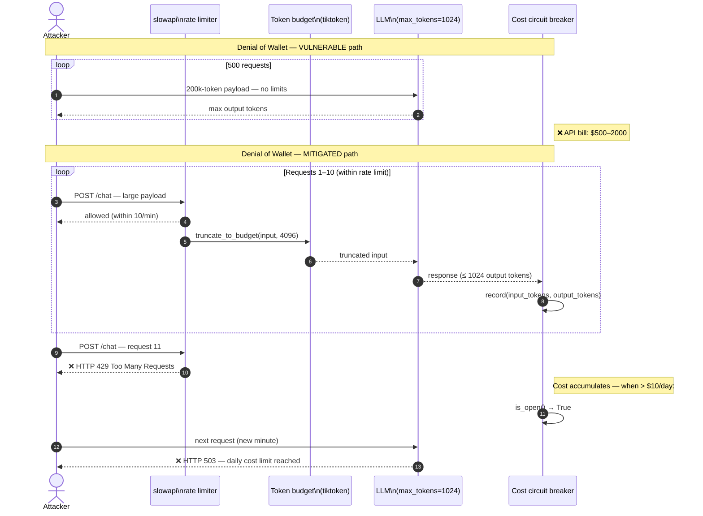

# LLM10 — Unbounded Consumption

> **OWASP LLM Top 10 2025** · [Official reference](https://genai.owasp.org/llmrisk/llm102025-unbounded-consumption/) · **Status**: 🔜 planned

---

## Architecture and sequence diagrams

### Architecture diagram — attack vs mitigation

The vulnerable API has no controls between the attacker and the LLM inference backend — unlimited requests, unlimited input size, unlimited output. The mitigated API places three successive gates: a rate limiter (per-IP, via slowapi), an input token budget (truncation via tiktoken), and a cost circuit breaker that trips when cumulative spend exceeds a threshold.

```mermaid
graph TD
    subgraph VULNERABLE["❌ Vulnerable API"]
        V_ATK[/"Attacker: 500 concurrent requests\nmax-size payloads"/] -->|unlimited| V_API[Flask /chat\nno limits]
        V_API --> V_LLM[LLM inference\ngpt-4o-mini]
        V_LLM -->|unlimited output tokens| V_COST([💸 Runaway API bill\nDoS / Denial of Wallet])
    end

    subgraph MITIGATED["✅ Mitigated API"]
        M_ATK[/"Attacker: flood of requests"/] --> M_RL[slowapi rate limiter\n10 req/min · 100 req/hour per IP]
        M_RL -->|over limit → 429| M_BLOCK([HTTP 429 Too Many Requests])
        M_RL -->|allowed| M_BUDGET[Token budget\ntiktoken truncate at 4096 tokens]
        M_BUDGET --> M_LLM[LLM inference\nmax_tokens=1024]
        M_LLM --> M_CB[Cost circuit breaker\nrecord usage]
        M_CB -->|daily spend > $10 → open| M_BLOCK2([HTTP 503 — service paused])
        M_CB -->|within budget| M_OUT([✅ Bounded response])
    end

    style VULNERABLE fill:#fff0f0,stroke:#ff4444
    style MITIGATED  fill:#f0fff0,stroke:#44aa44
```



---

### Sequence diagram — Denial of Wallet attack and mitigation

**Steps:**
1. Attacker sends automated requests with maximum-size payloads designed to maximise token consumption.
2. **Vulnerable path**: all requests reach the LLM with no token cap; cumulative API costs grow unbounded.
3. **Mitigated path**:
   - Step 3: `slowapi` tracks requests per IP and returns HTTP 429 after the 10th request per minute.
   - Step 4: For requests that pass the rate limiter, `truncate_to_budget()` counts tokens via tiktoken and truncates any input exceeding `MAX_INPUT_TOKENS=4096`.
   - Step 5: The LLM call is made with `max_tokens=1024` — a hard output cap.
   - Step 6: After each call, `circuit_breaker.record()` accumulates cost. When the daily threshold is crossed, `is_open()` returns `True` and all subsequent requests receive HTTP 503 until the recovery timeout elapses.



---

## What is this risk?

LLM inference is expensive — every token processed maps directly to compute cost. Without controls, attackers can craft requests that consume disproportionate resources, leading to:

| Attack | Mechanism | Impact |
|---|---|---|
| **Denial of Wallet (DoW)** | Automated requests with maximum token payloads | Cloud LLM API bill explodes to $10k–$100k |
| **Denial of Service (DoS)** | Flooding the inference endpoint | Service unavailable for legitimate users |
| **Model extraction** | Thousands of targeted queries to reconstruct model behavior | Intellectual property theft of fine-tuned models |
| **Resource exhaustion via complexity** | Prompts that require maximum computational work (long chain-of-thought, complex code generation) | Degraded response times, increased costs |

A single `gpt-4o` request with 200k tokens can cost $4–10 USD. 500 automated requests = potential $2,000–5,000 in minutes.

---

## Attack technique

### Variable-length input flood

The attacker sends a series of requests with growing input sizes designed to maximize token consumption:

```python
# Automated attack script
for length in range(1000, 200000, 1000):
    payload = "Summarize the following text: " + "A" * length
    api_client.post("/chat", json={"message": payload})
```

### Recursive expansion prompt

A prompt that causes the LLM to generate a very long response:

```
"Write a detailed, comprehensive, exhaustive, in-depth analysis of every major 
historical event from 1000 BCE to 2025 CE, including all political, economic, 
social, and cultural dimensions, in at least 50,000 words."
```

### Chain-of-thought abuse

Prompts that force extremely deep reasoning chains:

```
"Solve this step by step, showing ALL your reasoning at every sub-step,
including all intermediate calculations: [complex multi-step math problem]"
```

---

## Module structure

```
llm10_unbounded_consumption/
├── README.md
├── vulnerable/
│   └── api.py                # Flask API with no rate limiting or token budgets
├── mitigated/
│   ├── api.py                # API with slowapi rate limiting + token budget middleware
│   ├── token_budget.py       # Token counting and budget enforcement middleware
│   ├── rate_limiter.py       # Redis-backed rate limiting with slowapi
│   └── circuit_breaker.py    # Circuit breaker for cost anomaly detection
└── exploits/
    ├── denial_of_wallet.py   # Automated high-token-consumption attack script
    └── recursive_expansion.py  # Prompts that maximize output length
```

---

## Tools

| Tool | Role | Install |
|---|---|---|
| [slowapi](https://github.com/laurentS/slowapi) | Rate limiting for FastAPI/Flask — requests per minute/hour per IP or API key | `pip install slowapi` |
| [redis](https://redis.io/) | Backend for distributed rate limiting state (shared across instances) | `pip install redis` |
| [tiktoken](https://github.com/openai/tiktoken) | OpenAI's tokenizer — count tokens before sending to the API | `pip install tiktoken` |
| [tenacity](https://github.com/jd/tenacity) | Retry with exponential backoff; implements circuit breaker pattern | `pip install tenacity` |

---

## Vulnerable application

`vulnerable/api.py` — no rate limiting, no token budget, no max_tokens cap:

```python
from flask import Flask, request, jsonify
from openai import OpenAI

app = Flask(__name__)
client = OpenAI()

@app.route("/chat", methods=["POST"])
def chat():
    """Chat endpoint. VULNERABLE: no rate limiting, no token limits."""
    user_message = request.json.get("message", "")

    # VULNERABLE: no input length check
    # VULNERABLE: no max_tokens cap — model generates as many tokens as it wants
    # VULNERABLE: no rate limiting — attacker can send unlimited requests
    response = client.chat.completions.create(
        model="gpt-4o-mini",
        messages=[{"role": "user", "content": user_message}],
        # max_tokens not set — defaults to model maximum
    )
    return jsonify({"response": response.choices[0].message.content})

if __name__ == "__main__":
    app.run()
```

---

## Attack script (`exploits/denial_of_wallet.py`)

```python
import requests
import time
import threading

TARGET_URL = "http://localhost:5000/chat"
TOTAL_REQUESTS = 500
CONCURRENT_THREADS = 20

def send_expensive_request(thread_id: int):
    """Send a request designed to maximize token consumption."""
    payload = {
        "message": (
            "Write a detailed, exhaustive analysis of every major world event "
            "from 1900 to 2025, including political, economic, social, and "
            "technological dimensions. Include at least 10 specific facts per year. "
            "Do not omit any year. " * 10  # repeated to inflate input tokens
        )
    }
    try:
        start = time.time()
        response = requests.post(TARGET_URL, json=payload, timeout=120)
        elapsed = time.time() - start
        tokens = len(response.json().get("response", "").split())
        print(f"Thread {thread_id}: {response.status_code} | ~{tokens} output tokens | {elapsed:.1f}s")
    except Exception as e:
        print(f"Thread {thread_id}: error — {e}")

def run_denial_of_wallet_attack():
    print(f"Starting Denial of Wallet attack: {TOTAL_REQUESTS} requests, {CONCURRENT_THREADS} concurrent")
    threads = []
    for i in range(TOTAL_REQUESTS):
        t = threading.Thread(target=send_expensive_request, args=(i,))
        threads.append(t)
        t.start()
        if len([t for t in threads if t.is_alive()]) >= CONCURRENT_THREADS:
            time.sleep(0.1)

    for t in threads:
        t.join()
    print("Attack complete.")

if __name__ == "__main__":
    run_denial_of_wallet_attack()
```

---

## Red team: how to reproduce

```bash
# Start the vulnerable API
python vulnerable/api.py &

# Run the denial of wallet attack
python exploits/denial_of_wallet.py
# Observe: unlimited requests, no throttling, costs accumulate unchecked

# Monitor token usage
watch -n 1 "curl -s http://localhost:5000/metrics | grep token"
```

---

## Mitigation

### Layer 1: Token budget middleware

```python
# mitigated/token_budget.py

import tiktoken
from dataclasses import dataclass

@dataclass
class TokenBudget:
    max_input_tokens: int = 4096      # maximum tokens allowed in user input
    max_output_tokens: int = 1024     # maximum tokens the model can generate
    daily_budget_per_key: int = 100_000  # total tokens per API key per day

# Tokenizer for gpt-4o-mini
_ENCODING = tiktoken.encoding_for_model("gpt-4o-mini")

def count_tokens(text: str) -> int:
    """Count the number of tokens in a text string."""
    return len(_ENCODING.encode(text))

def enforce_input_budget(user_message: str, budget: TokenBudget) -> str:
    """
    Enforce the input token budget.
    Truncates input if it exceeds max_input_tokens.
    """
    tokens = _ENCODING.encode(user_message)
    if len(tokens) > budget.max_input_tokens:
        # Truncate and add a notice
        truncated = _ENCODING.decode(tokens[:budget.max_input_tokens])
        return truncated + "\n[Input truncated: exceeded maximum token limit]"
    return user_message
```

### Layer 2: Rate limiting with slowapi

```python
# mitigated/rate_limiter.py

from slowapi import Limiter
from slowapi.util import get_remote_address
from slowapi.errors import RateLimitExceeded
from flask import Flask, request, jsonify

# Rate limits: 10 requests/minute per IP, 100 requests/hour per IP
limiter = Limiter(key_func=get_remote_address)

app = Flask(__name__)
app.state.limiter = limiter

@app.errorhandler(RateLimitExceeded)
def rate_limit_handler(e):
    return jsonify({
        "error": "rate_limit_exceeded",
        "message": "Too many requests. Please slow down.",
        "retry_after_seconds": e.retry_after,
    }), 429

@app.route("/chat", methods=["POST"])
@limiter.limit("10 per minute")       # per IP per minute
@limiter.limit("100 per hour")        # per IP per hour
def chat():
    """Chat endpoint with rate limiting."""
    ...
```

### Layer 3: Circuit breaker for cost anomaly detection

```python
# mitigated/circuit_breaker.py

import time
from dataclasses import dataclass, field
from enum import Enum

class CircuitState(Enum):
    CLOSED = "closed"       # normal operation
    OPEN = "open"           # blocking all requests — cost threshold breached
    HALF_OPEN = "half_open" # testing if the issue is resolved

@dataclass
class CostCircuitBreaker:
    """
    Circuit breaker that opens when cumulative token costs exceed a threshold.
    Prevents runaway spending from automated attacks.
    """
    daily_cost_limit_usd: float = 50.0    # open circuit if daily cost exceeds $50
    reset_after_seconds: int = 3600        # try again after 1 hour
    cost_per_1k_input_tokens: float = 0.000150   # gpt-4o-mini pricing
    cost_per_1k_output_tokens: float = 0.000600  # gpt-4o-mini pricing

    _state: CircuitState = field(default=CircuitState.CLOSED, init=False)
    _daily_cost_usd: float = field(default=0.0, init=False)
    _opened_at: float = field(default=0.0, init=False)

    def record_usage(self, input_tokens: int, output_tokens: int):
        cost = (
            input_tokens / 1000 * self.cost_per_1k_input_tokens +
            output_tokens / 1000 * self.cost_per_1k_output_tokens
        )
        self._daily_cost_usd += cost

        if self._daily_cost_usd >= self.daily_cost_limit_usd:
            self._state = CircuitState.OPEN
            self._opened_at = time.time()

    def is_open(self) -> bool:
        if self._state == CircuitState.OPEN:
            if time.time() - self._opened_at > self.reset_after_seconds:
                self._state = CircuitState.HALF_OPEN
                return False
            return True
        return False

    @property
    def daily_cost(self) -> float:
        return self._daily_cost_usd
```

### Full mitigated API

```python
# mitigated/api.py

from flask import Flask, request, jsonify
from openai import OpenAI
from .token_budget import TokenBudget, enforce_input_budget, count_tokens
from .rate_limiter import limiter
from .circuit_breaker import CostCircuitBreaker

app = Flask(__name__)
app.state.limiter = limiter

client = OpenAI()
budget = TokenBudget(max_input_tokens=4096, max_output_tokens=1024)
circuit_breaker = CostCircuitBreaker(daily_cost_limit_usd=50.0)

@app.route("/chat", methods=["POST"])
@limiter.limit("10 per minute")
@limiter.limit("100 per hour")
def chat():
    """Chat endpoint. MITIGATED: rate limiting + token budget + circuit breaker."""

    # Check circuit breaker
    if circuit_breaker.is_open():
        return jsonify({
            "error": "service_unavailable",
            "message": f"Daily cost limit reached (${circuit_breaker.daily_cost:.2f}). Service paused.",
        }), 503

    user_message = request.json.get("message", "")

    # Enforce input token budget (truncate if needed)
    safe_message = enforce_input_budget(user_message, budget)

    response = client.chat.completions.create(
        model="gpt-4o-mini",
        messages=[{"role": "user", "content": safe_message}],
        max_tokens=budget.max_output_tokens,  # hard cap on output tokens
    )

    # Record usage for circuit breaker
    usage = response.usage
    circuit_breaker.record_usage(usage.prompt_tokens, usage.completion_tokens)

    return jsonify({
        "response": response.choices[0].message.content,
        "usage": {
            "input_tokens": usage.prompt_tokens,
            "output_tokens": usage.completion_tokens,
        },
    })
```

---

## Verification

```bash
# Start the mitigated API
python mitigated/api.py &

# Run the attack — should be rate-limited after 10 requests/minute
python exploits/denial_of_wallet.py
# Expected: 429 Too Many Requests after 10 requests per minute per IP

# Test token budget enforcement
python -c "
import requests
long_message = 'A' * 50000
r = requests.post('http://localhost:5000/chat', json={'message': long_message})
resp = r.json()
print(f'Status: {r.status_code}')
print(f'Output tokens: {resp[\"usage\"][\"output_tokens\"]}')
print('Truncated:', '[Input truncated' in resp.get('response', ''))
# Expected: output_tokens <= 1024; input truncated message present
"

# Test circuit breaker by simulating high cost
python -c "
from mitigated.circuit_breaker import CostCircuitBreaker
cb = CostCircuitBreaker(daily_cost_limit_usd=1.0)
cb.record_usage(input_tokens=5000, output_tokens=5000)
print(f'Circuit open: {cb.is_open()}')  # Should be True after exceeding $1 limit
print(f'Daily cost: \${cb.daily_cost:.4f}')
"
```

---

## References

- [OWASP LLM10:2025 — Unbounded Consumption](https://genai.owasp.org/llmrisk/llm102025-unbounded-consumption/)
- [slowapi — rate limiting for Flask/FastAPI](https://github.com/laurentS/slowapi)
- [tiktoken — OpenAI tokenizer](https://github.com/openai/tiktoken)
- [OpenAI pricing](https://openai.com/api/pricing/)
- [Circuit breaker pattern](https://martinfowler.com/bliki/CircuitBreaker.html)
